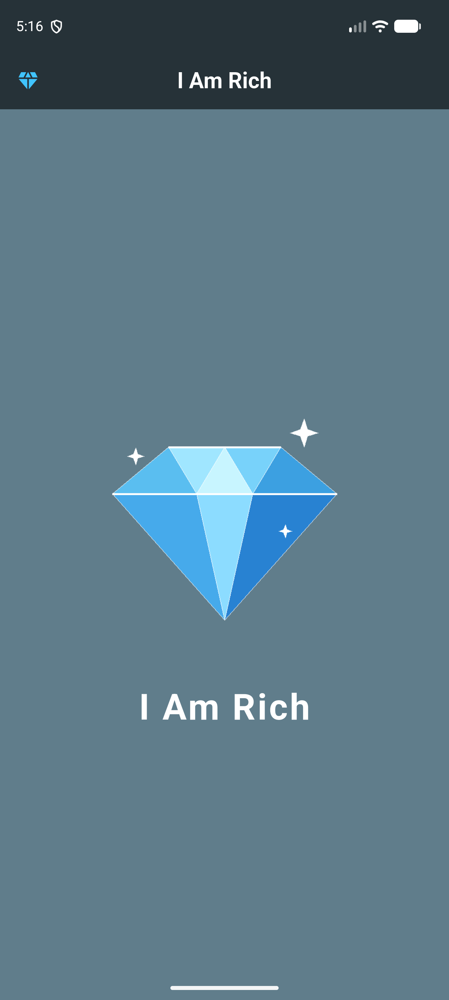

# Lab 1: I Am Rich

Ứng dụng Flutter cơ bản hiển thị hình viên kim cương và dòng chữ "I Am Rich".

## Chức năng

- Hiển thị giao diện đơn giản với hình ảnh và biểu tượng diamond (`Icons.diamond`).
- Sử dụng tài nguyên ảnh từ thư mục `images/` (khai báo trong `pubspec.yaml`).
- Làm quen với `MaterialApp`, `Scaffold`, `AppBar`, `Center`, `Column`, `Image`, `Text`.

## Cấu trúc chính

- `lib/main.dart`
- `images/diamond.png`

## Chạy ứng dụng

```bash
flutter pub get
flutter run
```

## Demo


